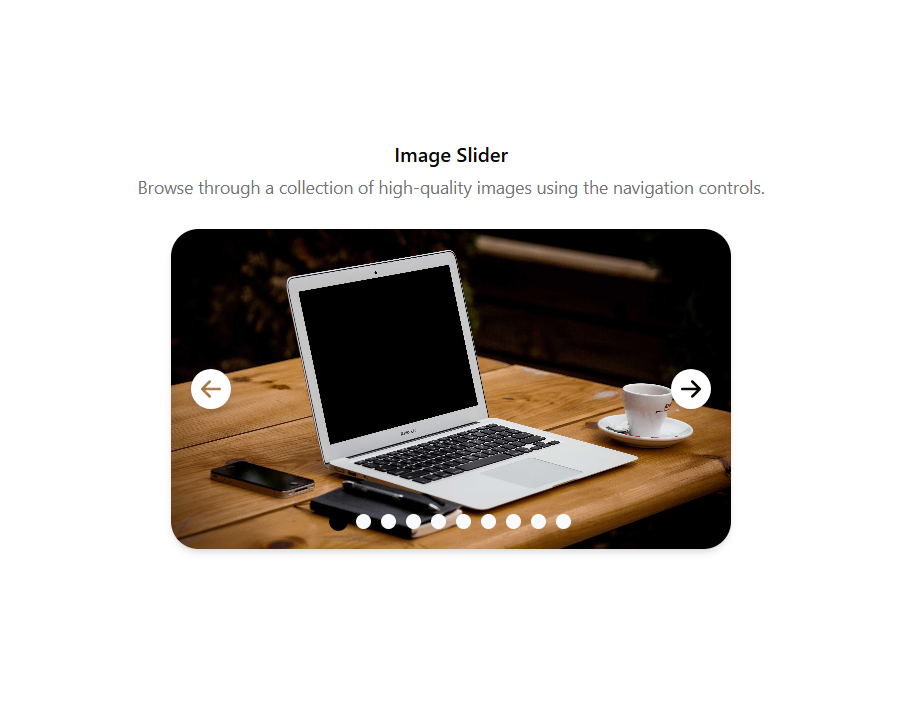

# 🖼️ React Image Slider Component

A high-performance, polished, and fully responsive **Image Slider** built with **React 19**, **TypeScript**, **Tailwind CSS** and Shadcn UI. This component fetches dynamic data from the Picsum API and features smooth cross-fade transitions and modern UI elements.



## 🚀 Live Demo

Check out the live demo here: [Live Demo](https://practice-react-image-slider.pages.dev/)

## ✨ Features

- **Dynamic Fetching**: Loads high-quality images directly from the Picsum API based on configurable limits.
- **Smooth Transitions**: Utilizes custom Tailwind CSS animations and opacity transitions for a premium "fade" effect.
- **Responsive Design**: Fully optimized for mobile, tablet, and desktop viewports using Tailwind's layout engine.
- **Interactive Controls**: Features intuitive navigation arrows and circular indicators that sync with the current slide.
- **Performance Optimized**: Uses `useCallback` for stable function references and `opacity` layering for GPU-accelerated animations.
- **Modern Tech Stack**: Built with **React 19**, **Shadcn UI**, and **Tailwind v4**.

## 🛠️ Built With

- **Framework**: [React 19](https://react.dev/)
- **Styling**: [Tailwind CSS v4](https://tailwindcss.com/)
- **Components**: [Shadcn UI](https://ui.shadcn.com/)
- **Icons**: [React Icons](https://react-icons.github.io/react-icons/)
- **Data Source**: [Picsum Photos](https://picsum.photos/)

## 🚀 Getting Started

### 1. Clone the repository

```bash
git clone https://github.com/your-username/react-image-slider-component.git
```

### 2. Install dependencies

```bash
npm install
```

### 3. Run the development server

```bash
npm run dev
```

## 📖 Documentation

### Usage Example

```tsx
import ImageSlider from "./components/image-slider/ImageSlider";

function App() {
  return (
    <div className="App">
      <ImageSlider url="https://picsum.photos/v2/list" limit={10} page={1} />
    </div>
  );
}
```

### Prop Documentation

| Prop    | Type     | Default      | Description                                |
| :------ | :------- | :----------- | :----------------------------------------- |
| `url`   | `string` | **Required** | The base API URL to fetch images from.     |
| `limit` | `number` | `5`          | The number of images to fetch and display. |
| `page`  | `number` | `1`          | The page number for API pagination.        |

### Project Structure

```text
src/
├── components/
│   ├── ui/             # Shadcn UI base components
│   └── image-slider/
│       └── ImageSlider.tsx
├── lib/
│   └── utils.ts       # cn() utility for Tailwind merging
├── App.tsx             # Main entry point
├── index.css           # Global styles and Tailwind utilities
└── main.tsx
```

---

Built with ❤️ by [Yehia](https://github.com/yehia)
